## Ray tracing in a nutshell
- Ref: [Ray tracing in one weekend](https://raytracing.github.io/books/RayTracingInOneWeekend.html)

### Empedocles
- Emission theory


### see = color * brightness
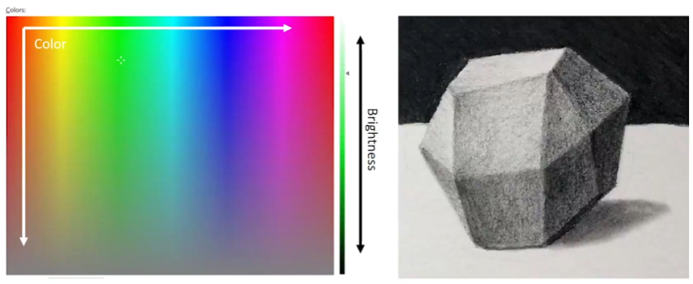

#### The Lambertian reflectance model
用能量守恒的观点看待反射


$$ \text{Brightness} = \cos(\theta) $$
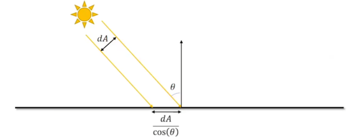

#### The Phong reflectance model
反光方向与视线的夹角


$$ \text{Brightness} = (V \cdot R)^{\alpha} = (\cos(\theta)) ^{\alpha} $$
$\alpha$ is the hardness

#### The Blinn-Phong reflectance model

$$ \text{Brightness} = (N \cdot H)^{\alpha} = (\cos(\theta)) ^{\alpha'} , H=\frac{V+L}{||V+L||}$$
$\alpha' < \alpha$ is the hardness in Blinn-Phong


### The Whitted-style ray tracer
- An improved illumination model for shaded display [Whitted, 1979] [[Link]()]

#### Shadow
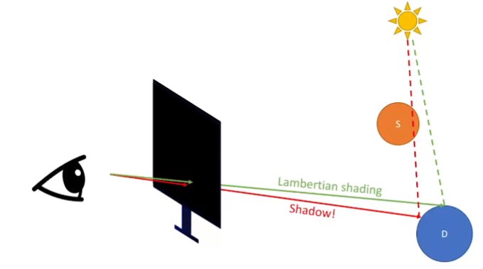
#### Reflection - Mirror
递归

#### Refractuion - Dielectric


### The Path Tracer
modern ray tracer

Global illumination(GI) 全局光照，表示漫反射表面是否继续反光

#### Diffuse surfaces

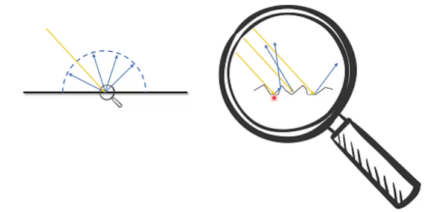


#### Monte Carlo method
随机 N 次估算物理量


N = 1, add SPP(sample per pixel)
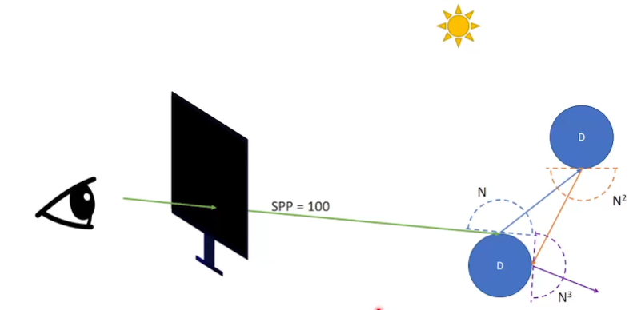
#### Russian Roulette
- stop recursion by probability$p_{RR}$(for instance 90%)
- else
  - go on recursion: what is $L_i$
  - Return $L_o/p_{RR}$

### Conclusion


### Further readings
- The rendering equation [Kajiya 1986]

$$ L_{o}=L_{e}+\int_{\Omega} L_{i} \cdot f_{r} \cdot \cos \theta \cdot d \omega $$

- Fundamentals of Computer Graphics
- Physically Based Rendering: From Theory To Implementation
- Ray Tracing
  - In one weekend
  - The next week
  - The rest of your life
- GAMES 101
- GAMES 102


## Ray tracing in action

### Ray casting
#### 1. Ray
- $P=0+t \overrightarrow{\boldsymbol{d}}$


#### 2. Positioning the camera/eye (lookfrom)
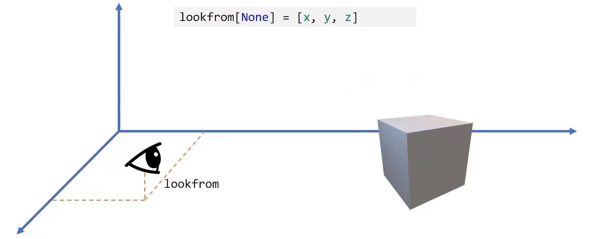
#### 3. Orienting the camera/eye (lookat)
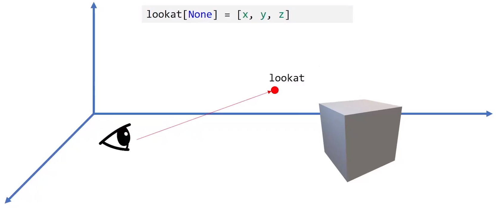
#### 4. Placing the screen
1. `distance` from the eye to the center of the screen
2. orientation `up` of the screen


#### 5. Sizing the screen (field of view)
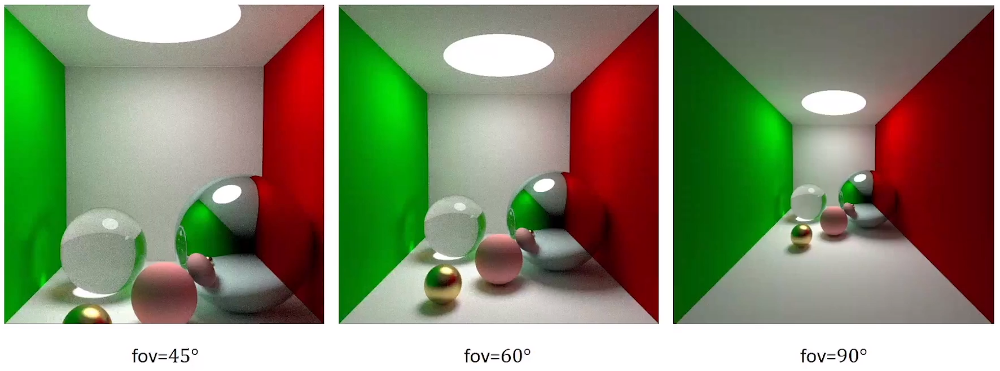
- `fov`: field of view $\theta$
- `aspect_ration`

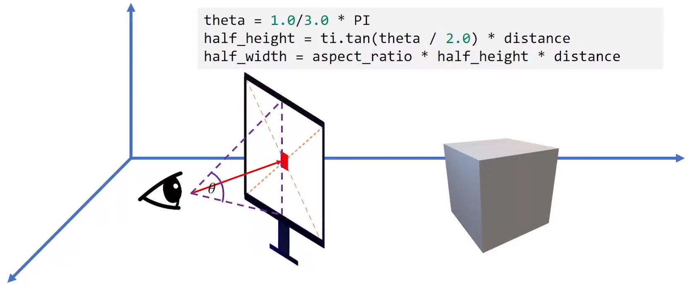

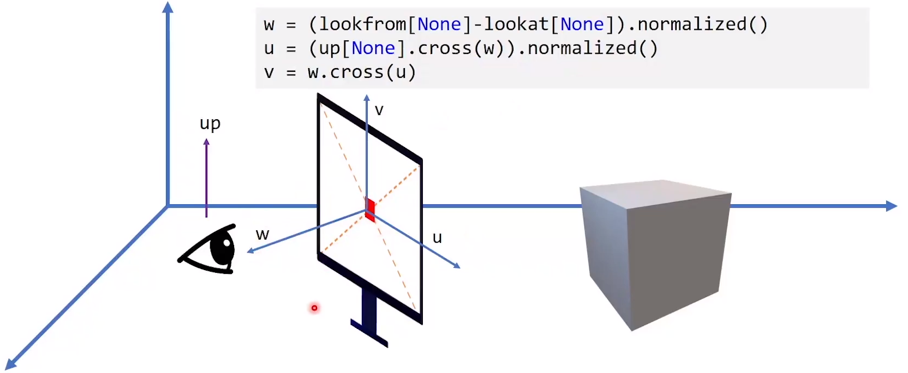
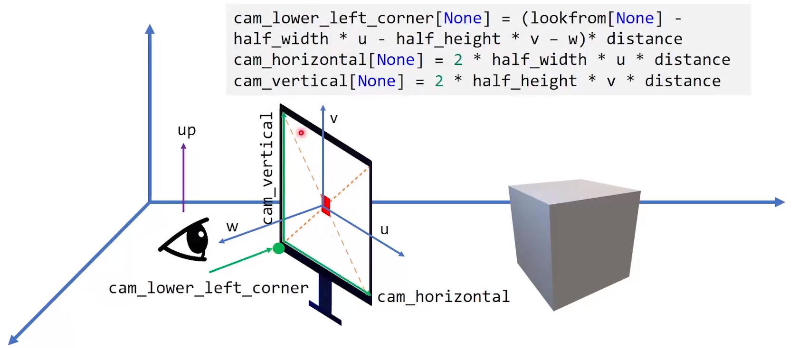
#### 6. Ray Casting!!


ray across the center of a pixel
``` Python
u = float(i+0.5)/res_x
v = float(j+0.5)/res_y
```
### Ray-object intersection
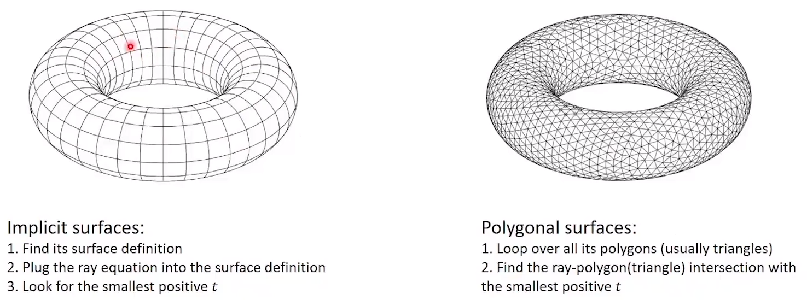
#### Sphere
- $\|P-C\|^{2}-r^{2}=0$

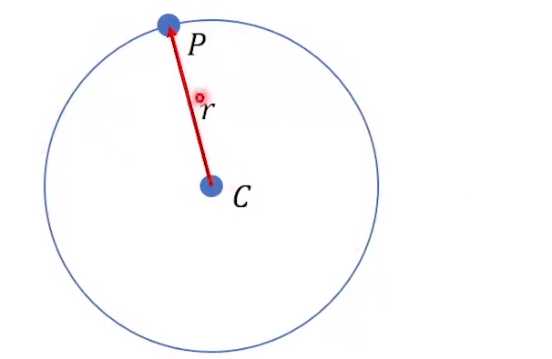
  $$ a t^{2}+b t+c=0 \Rightarrow t=\frac{-b \pm \sqrt{b^{2}-4 a c}}{2 a}, t>\epsilon $$
- for instance, $\epsilon = 0.001$


#### Plane
- $(P-C)^{T} N=0$

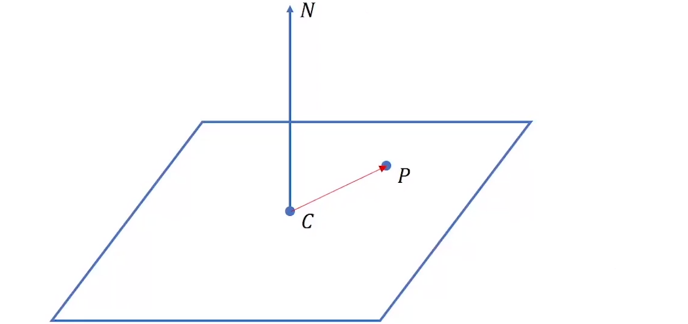

- $(O+t \overrightarrow{\boldsymbol{d}}-C)^{T} N=0$

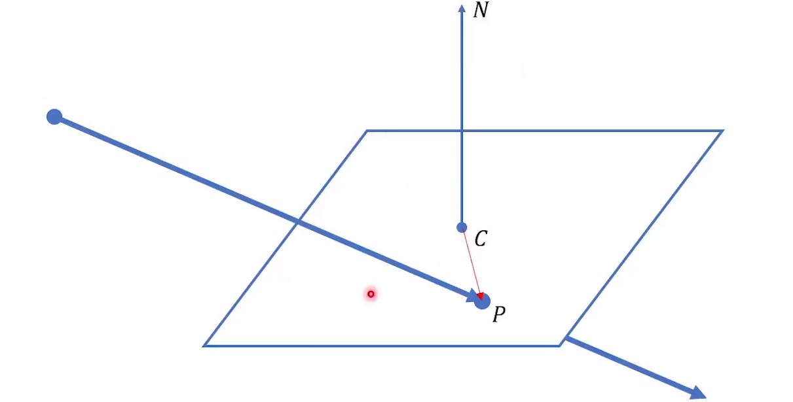

#### Triangle
1. intersect with triangle plane
2. inside the triangle


### Sampling
#### Importance Sampling
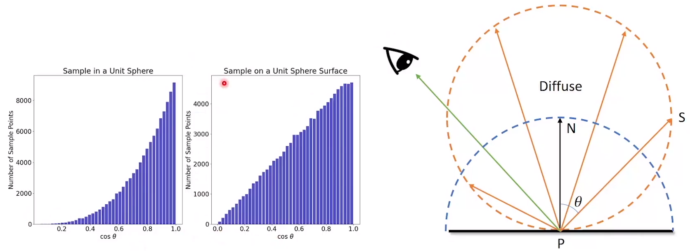

### Reflection and Refraction

#### The reflection coeffient: $R$
- The refraction coefficient $T = 1- R$
- material dependent
- view point dependent

##### Fresnel's Equation
- s-polarization 
  $$R_{S}=\left(\frac{n_{1} \cos \left(\theta_{i}\right)-n_{2} \cos \left(\theta_{t}\right)}{n_{1} \cos \left(\theta_{i}\right)+n_{2} \cos \left(\theta_{t}\right)}\right)^{2}$$
- P-polarization 
  $$R_{P}=\left(\frac{n_{1} \cos \left(\theta_{t}\right)-n_{2} \cos \left(\theta_{i}\right)}{n_{1} \cos \left(\theta_{t}\right)+n_{2} \cos \left(\theta_{i}\right)}\right)^{2}$$
- For "natural light" 
  $$R=\frac{1}{2}\left(R_{S}+R_{P}\right)$$

##### Schlick's approximation
$$R\left(\theta_{i}\right)=R_{0}+\left(1-R_{0}\right)\left(1-\cos \left(\theta_{i}\right)\right)^{5}$$
$$R_{0}=\left(\frac{n_{1}-n_{2}}{n_{1}+n_{2}}\right)^{2}$$

### Result


