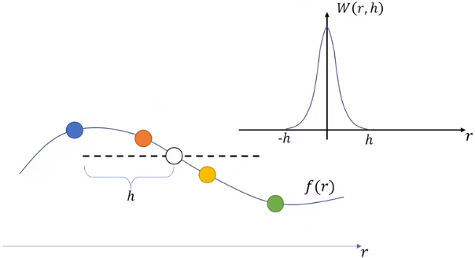
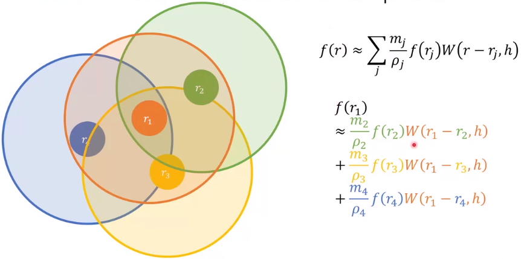
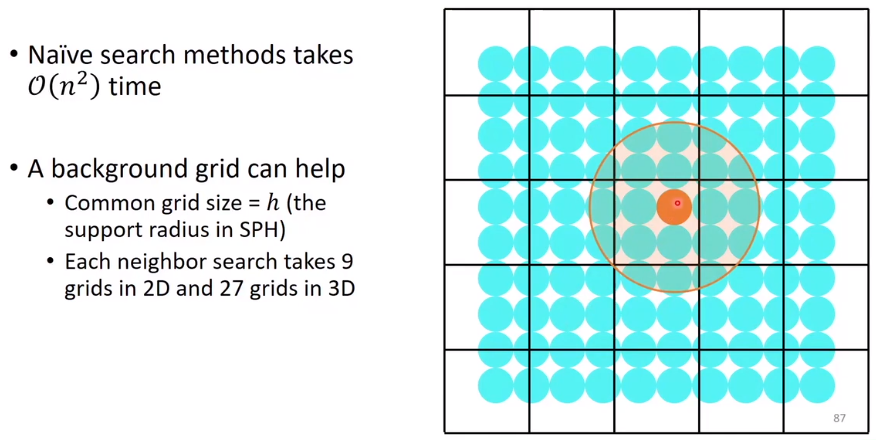

# Fluid Simulation

SPH 光滑粒子水动力学

## Incompressible Navier-Stokes equation

流体可分为可压缩流体（爆炸、冲击波）和不可压缩流体（缓慢的烟尘、水）。课程关注不可压缩流体。

$$f=f_{ext}+f_{pres}+f_{visc}=ma$$

符号说明：

- 梯度：$\nabla_{S}=\left[\frac{\partial s}{\partial x}, \frac{\partial s}{\partial y}, \frac{\partial s}{\partial z}\right]^{T}$
- 散度 $\operatorname{div} v=\nabla \cdot v=\frac{\partial v_{x}}{\partial x}+\frac{\partial v_{y}}{\partial y}+\frac{\partial v_{z}}{\partial z}$
- 旋度 $\operatorname{curl} v=\nabla \times v=\left[\frac{\partial v_{z}}{\partial y}-\frac{\partial v_{y}}{\partial z}, \frac{\partial v_{z}}{\partial x}-\frac{\partial v_{x}}{\partial z}, \frac{\partial v_{y}}{\partial x}-\frac{\partial v_{x}}{\partial y}\right]^{T}$
- 拉普拉斯(laplace) $\Delta s = \nabla^{2} s=\frac{\partial^{2} s}{\partial x^{2}}+\frac{\partial^{2} s}{\partial y^{2}}+\frac{\partial^{2} s}{\partial z^{2}}$

$\rho$: 密度
$\frac{D(\cdot)}{Dt}$: 速度对时间的材料导数
$g$: 重力加速度
$p$: 压力 $p=k(\rho - \rho_0)$
$\mu$: 系数，shear modulus(dynamic vic.) $v = \frac{\mu}{\rho_0}$ 物理意义表示扩散速度

$\mu \nabla^2 v$ 是一个粘性项，表示粒子在运动时要与周围粒子尽可能保持一致，其中 $\mu$ 用于区别不同物质的粘性

$\nabla \cdot v = 0 \rightleftharpoons \frac {D\rho}{Dt}=\rho(\nabla \cdot v) = 0$ **不可压缩特性**导致流入与流出的液体总是尽可能保持一致，在一个方向上加速时另一个方向就会减速

### Time integration

两步积分（Advection-Projection）：

- Advection: input $v_n$ output $v_{n+0.5}$
  - $\rho \frac{D v}{D t}=\rho g+\mu \nabla^{2} v$
  - Solve: $dv = g + v \nabla^2v_n$
  - Update: $v_{n+0.5} = v_n+\Delta t dv$
- Projection: input $v_{n+0.5}$ output $v_{n+1}$
  - $\rho \frac{D v}{D t}=-\nabla p$
  - $\nabla \cdot v = 0$
  - Solve: $dv=-\frac{1}{\rho}\nabla(k(\rho-\rho_0))$ and $\frac{D \rho}{D t}=\nabla \cdot\left(v_{n+0.5}+d v\right)=0$
  - Update: $v_{n+1}=v_{n+0.5}+\Delta v_{n+1}$
- Update position:
  - $x_{n+1}=x_n+\Delta t v_{n+1}$
- Return x_{n+1}, v_{n+1}

### Space Discretization (Lagrangian view)

拉格朗日视角：物体的运动可以离散到带有信息的质点上

$$\frac{d v_{i}}{d t}=g-\frac{1}{\rho} \nabla p\left(x_{i}\right)+v \nabla^{2} v\left(x_{i}\right) \quad, \text { where } v=\frac{\mu}{\rho_{0}}$$

- for i in particles:
  - $v_i = v_i + \Delta t a_i$
- for i in particles:
  - $x_i = x_i + \Delta t v_i$

#### Dirac delta

$$f(r)=\int_{-\infty}^{\infty} f\left(r^{\prime}\right) \delta\left(r-r^{\prime}\right) d r^{\prime}$$

$$\delta(r)=\left\{\begin{array}{l}
+\infty, \text { if } r=0 \\
0, \text { otherwise }
\end{array} \text { and } \int_{-\infty}^{\infty} \delta(r) d r=1\right.$$

#### Widen the Dirac delta

$$f(r) \approx \int f\left(r^{\prime}\right) W\left(r-r^{\prime}, h\right) d r^{\prime}, \text { where } \lim _{h \rightarrow 0} W(r, h)=\delta(r)$$

for example:

$$W(r, h)=\left\{\begin{array}{l}
\frac{1}{2 h}, \text { if }|r|<h \\
0, \text { otherwise }
\end{array}\right.$$

#### from integration to summation

$$f(r) \approx \int f\left(r^{\prime}\right) W\left(r-r^{\prime}, h\right) d r^{\prime} \approx \sum_{j} V_{j} f\left(r_{j}\right) W\left(r-r_{j}, h\right)$$

#### A smoother kernel function

$$f(r) \approx \sum_{j} V_{j} f\left(r_{j}\right) W\left(r-r_{j}, h\right)$$

$$W(r, h)=\sigma_{d} \begin{cases}6\left(q^{3}-q^{2}\right)+1 & \text { for } 0 \leq q \leq \frac{1}{2} \\ 2(1-q)^{3} & \text { for } \frac{1}{2} \leq q \leq 1 \\ 0 & \text { otherwise }\end{cases}$$
$$\text { with } q=\frac{1}{h}\|r\|, \sigma_{1}=\frac{4}{3 h}, \sigma_{2}=\frac{40}{7 \pi h^{2}}, \sigma_{3}=\frac{8}{\pi h^{3}}$$

#### Smoothed particle hydrodynamics (SPH)

Theory and application to non-spherical stars [Gingold and Monaghan 1977]
SPH 是流体仿真中用来做空间离散化的方式，根据已知点来确定未知点的函数值

$$f(r) \approx \sum_{j} V_{j} f\left(r_{j}\right) W\left(r-r_{j}, h\right) = \sum_{j} \frac{m_j}{\rho_j}f(r_j) \nabla W(r-r_j, h)$$

#### A smooth particle in 2D

Smoothed particle 是空间中采样的一种方式，是图上的大圆

Support radius: 用于估计值

SPH discretization:
$$f(r) \approx \sum_{j} \frac{m_j}{\rho_j} f(r_{j}) W\left(r-r_{j}, h\right)$$

SPH spatial derivatives:

- $\nabla f(r) \approx \sum_{j} \frac{m_j}{\rho_j} f(r_{j})\nabla W\left(r-r_{j}, h\right)$
- $\nabla \cdot f(r) \approx \sum_{j} \frac{m_j}{\rho_j} f(r_{j})\cdot \nabla W\left(r-r_{j}, h\right)$
- $\nabla \times f(r) \approx \sum_{j} \frac{m_j}{\rho_j} f(r_{j})\times \nabla W\left(r-r_{j}, h\right)$
- $\nabla^2 f(r) \approx \sum_{j} \frac{m_j}{\rho_j} f(r_{j})\nabla^2 W\left(r-r_{j}, h\right)$

#### Improving approximation

anti-symmetric form
$$\nabla f(r) \approx \sum_{j} m_j\frac{f(r_{j}) - f(r)}{\rho_j} \nabla W\left(r-r_{j}, h\right)$$
symmetric form
$$\nabla f(r) \approx \rho \sum_{j} m_j(\frac{f(r_{j})}{\rho_j^2}+\frac{f(r)}{\rho^2}) \nabla W\left(r-r_{j}, h\right)$$

## Implementation (WCSPH)

[[实现细节](https://www.bilibili.com/video/BV1mi4y1o7wz?p=4)]

### Simulation pipeline

- for i in particles:
  - search for neighbors j
- for i in particles:
  - sample the velocity/density field using SPH
  - compute force/acceleration using Navier-Stokes equation
- for i in particles:
  - update velocity using acceleration
  - update position using velocity

### Bondary Condition

边界存在采样不足的问题

- 液体表面
  - 密度压强下降，会导致表面液体容易飞出去
  - $p=\max(0, k(\rho - \rho_0))$ 将负值去掉
- 固液表面
  - 密度压强下降
  - $p=\max(0, k(\rho - \rho_0))$
  - Solution 1: 在边界给粒子反方向的速度
  - Solution 2：加一些不存在的粒子
    - $\rho_{solid}=\rho_0$
    - $v_{solid}=0$

### Neighbor Search

## Example

- [Eulerian Fluid](https://github.com/JerryYan97/Taichi_HW1_EulerianFluid)
